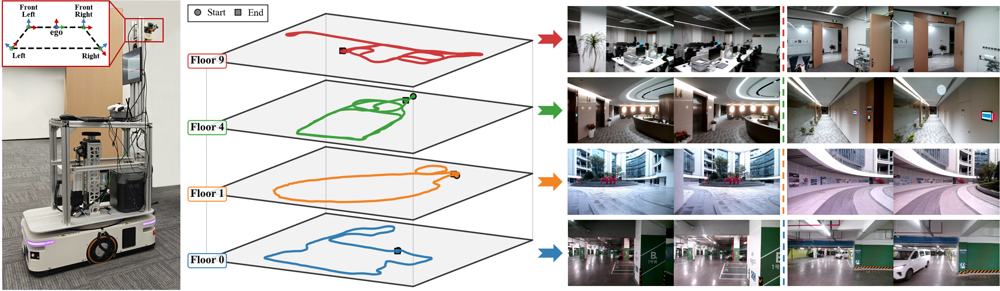
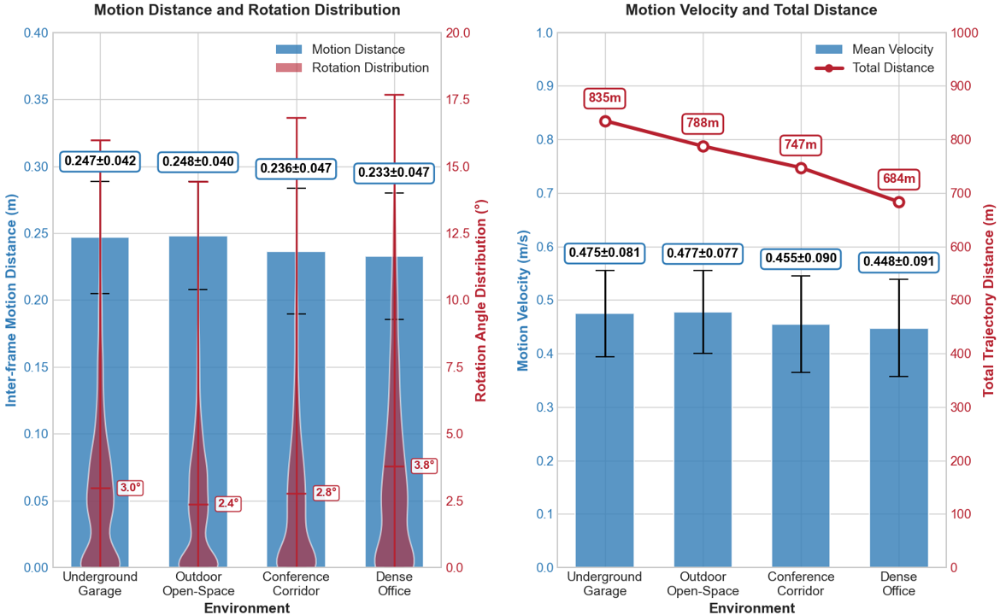

# ZJH-VO Dataset

A comprehensive multi-scene and multi-scale benchmark dataset for ground vehicle visual odometry in intelligent transportation systems.

## 📊 Dataset Overview

The ZJH-VO dataset is designed to address the lack of publicly available benchmarks with diversity in scale and scene characteristics for ground vehicle navigation. It provides challenging scenarios across multiple floors of an office complex.


*ZJH-VO Multi-Scale Dataset Overview. Left: Data collection vehicle and camera coordinate system setup with PV-BEV transformation. Center: Representative trajectory paths across four floors (Floor 9, 4, 1, and 0). Right: Sample image pairs from each environment showing diverse scene characteristics.*

## 🚗 Key Features

- **12 trajectories** across 4 distinct environments
- **12,666 frames** with 8-frame sampling intervals  
- **3,054 meters** of total motion data
- **Ground truth poses** from 2D LiDAR SLAM
- **Multi-camera system** with hardware synchronization
- **Diverse motion patterns** including large rotations and various speeds

## 📁 Dataset Structure

### Environment Characteristics

| Environment | Object Distance | Complexity | BEV Challenge | ITS Application |
|------------|----------------|------------|--------------|-----------------|
| **Dense Office** | Short range | Complex | Large rotations, texture-less walls | Last-mile Delivery |
| **Conference Corridor** | Short-Medium range | Medium | Variable lighting, narrow passages | Service Robots |
| **Outdoor Open-Space** | Long range | Medium | Sparse features, ground-dominant | Campus Navigation |
| **Underground Garage** | Medium range | Simple | Dynamic vehicles, dim lighting | Autonomous Parking |

### Motion Statistics


*ZJH-VO Multi-Scale dataset motion statistics across four environment types. Left: Inter-frame motion distance and rotation angle distributions with statistical measures. Right: Mean motion velocity and total trajectory distance for each environment sequence.*

- **Inter-frame distances**: 0.00 - 0.31m
- **Inter-frame rotation angles**: 0.00° - 17.70°
- **Motion velocities**: 0.00 - 0.59 m/s

## 🔧 Hardware Configuration
- **Platform**: Four-wheeled mobile robot without suspension
- **Cameras**: 4-camera system with hardware sync
  - Front stereo pair
  - left and right cameras
- **Ground Truth**: 2D LiDAR for pose generation

## 📥 Download

The dataset is available in the following formats:

| Component | Size | Link |
|-----------|------|------|
| Full Dataset | ~73 GB | [Download from BaiduPan](https://pan.baidu.com/s/1chw2FQsG-sPkaMWTrGCH8A?pwd=zjhd) |

## 📂 File Format

```
ZJH-VO/
├── Floor_00/
│   ├── traj_1/
│   │   ├── cam_front_left/
│   │   │   ├── 1729928902.817029.jpg
│   │   │   ├── 1729928902.884322.jpg
│   │   │   └── ...
│   │   ├── cam_front_right/
│   │   ├── cam_left/
│   │   ├── cam_right/
│   │   └── tum_gt.txt
│   ├── traj_2/
│   └── traj_3/
├── Floor_01/
├── Floor_04/
├── Floor_09/
└── calibration.yaml
```

### Pose Format

Each line in `poses.txt` contains:
```
timestamp x y z qx qy qz qw
```

### Calibration Format

A single `calibration.txt` file is provided containing:

- **Image resolution**: 1152 × 720 pixels
- **Camera intrinsics**: 3×3 camera matrix and distortion coefficients for all 4 cameras (front_left, front_right, right, left)
- **Camera extrinsics**: Transformation matrices (quaternion and 4×4 matrix) from each camera to the ego vehicle coordinate frame

## 📊 Benchmark Results

A comparison of representative monocular visual odometry (MVO) methods on the ZJH-VO dataset:

| Method | RTE (%) | RRE (°/100m) | APE (m) |
|--------|---------|--------------|---------|
| ORB-SLAM3 | 8.94* | 14.21* | 4.28* |
| DeepVO | 51.95 | 109.11 | 20.06 |
| TartanVO | 10.31 | 17.40 | 5.79 |
| DF-VO | 60.00 | 105.66 | 36.73 |  
| DROID-SLAM | 15.75 | 22.11 | 11.81 |
| DPVO | 14.74 | 19.65 | 10.90 |
| BEV-ODOM | 7.28 | 7.98 | 3.95 |
| **BEV-ODOM2** | **3.57** | **4.69** | **2.11** |

*Partial trajectory due to tracking failure

## 📝 Citation

If you use this dataset in your research, please cite:

```bibtex
@article{wei2025bevodom2,
  title={BEV-ODOM2: Enhanced BEV-based Monocular Visual Odometry with PV-BEV Fusion and Dense Flow Supervision for Ground Robots},
  author={Wei, Yufei and Lu, Wangtao and Hu, Chenxiao and Lu, Sha and Han, Fuzhang and Xiong, Rong and Wang, Yue},
  journal={xxx},
  volume={xxx},
  number={xxx},
  pages={xxx},
  year={2025}
}
```

## 🤝 Contributing

We welcome contributions to improve the dataset! Please feel free to:
- Report issues or bugs
- Suggest improvements
- Share your benchmark results
- Contribute evaluation tools

## 📧 Contact

For questions or issues regarding the dataset, please contact:
- **Yufei Wei**: 12232028@zju.edu.cn
- **Yue Wang** (Corresponding author): wangyue@iipc.zju.edu.cn
